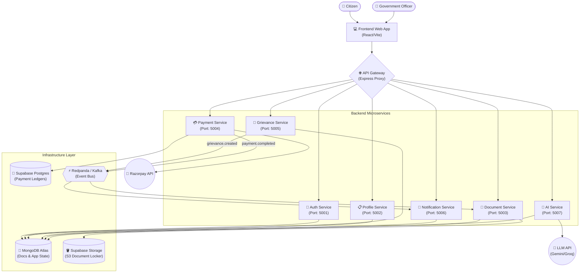

# CivicConnect

CivicConnect is a comprehensive, microservices-based portal designed to simplify and unify government services for citizens. It provides a single point of access for profile management, grievance reporting, document verification, and fee payments, augmented by a local AI advisor for Scheme Eligibility.

## 🏛️ Architecture

CivicConnect leverages a robust, event-driven microservices architecture to ensure scalability, fault isolation, and separation of concerns.



## ✨ Key Features

1. **Centralized Identity & Profile (`auth-service`, `profile-service`)**
   - OTP-based authentication (simulated for dev).
   - Unified citizen profile storing demographics and addresses, determining eligibility.
   - Profile completeness scoring. Profile picture uploads supported via Base64 storage in Mongo.

2. **Grievance Redressal (`grievance-service`)**
   - Citizens can file complaints which are auto-classified into departments based on severity.
   - Triggers async Kafka events.

3. **Digital Document Locker (`document-service`)**
   - Secure S3 (Supabase Storage) integration for citizen documents (Aadhaar, PAN).
   - Async AI processing to verify document validity and extract metadata automatically.

4. **Payments Portal (`payment-service`)**
   - Real Razorpay Integration with simulated fallback for local development.
   - Supabase PostgreSQL ledger enforces ACID compliance for all financial transitions.

5. **AI Scheme Advisor (`ai-service`)**
   - RAG (Retrieval-Augmented Generation) pipeline over MongoDB Vector Search.
   - Suggests government schemes based on the citizen's profile context.

6. **Notification System (`notification-service`)**
   - Listens to Kafka topics (`grievance.created`, `payment.completed`) to dispatch transactional alerts.

## 🚀 Getting Started

### Prerequisites
- Node.js (v18+)
- Local `.env` file configured with MongoDB Atlas, Redpanda Kafka, Supabase, and Razorpay test credentials.

### Running Locally
To launch all services simultaneously on a Windows machine:
```bash
.\start-all.bat
```
This script will start the React Frontend, API Gateway, and all 7 microservices concurrently.

**Stopping Services:**
```bash
.\stop-all.bat
```

### Accessing the Application
- **Frontend Dashboard:** `http://localhost:5173`
- **API Gateway:** `http://localhost:4000`

---
*Built to bring governance to your fingertips.*
